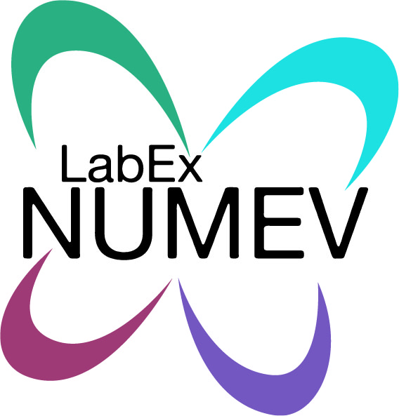
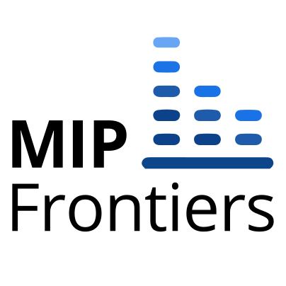

# SciPy 2022 virtual poster: Programmatic debugging and dissection of ML models with NoPdb

[![Binder](https://img.shields.io/badge/binder-notebook-blue?logo=data:image/png;base64,iVBORw0KGgoAAAANSUhEUgAAADMAAAAzCAYAAAA6oTAqAAAAAXNSR0IArs4c6QAAAG5lWElmTU0AKgAAAAgAAwESAAMAAAABAAEAAAExAAIAAAARAAAAModpAAQAAAABAAAARAAAAABBZG9iZSBJbWFnZVJlYWR5AAAAA6ABAAMAAAABAAEAAKACAAQAAAABAAAAM6ADAAQAAAABAAAAMwAAAABw10UUAAABy2lUWHRYTUw6Y29tLmFkb2JlLnhtcAAAAAAAPHg6eG1wbWV0YSB4bWxuczp4PSJhZG9iZTpuczptZXRhLyIgeDp4bXB0az0iWE1QIENvcmUgNi4wLjAiPgogICA8cmRmOlJERiB4bWxuczpyZGY9Imh0dHA6Ly93d3cudzMub3JnLzE5OTkvMDIvMjItcmRmLXN5bnRheC1ucyMiPgogICAgICA8cmRmOkRlc2NyaXB0aW9uIHJkZjphYm91dD0iIgogICAgICAgICAgICB4bWxuczp0aWZmPSJodHRwOi8vbnMuYWRvYmUuY29tL3RpZmYvMS4wLyIKICAgICAgICAgICAgeG1sbnM6eG1wPSJodHRwOi8vbnMuYWRvYmUuY29tL3hhcC8xLjAvIj4KICAgICAgICAgPHRpZmY6T3JpZW50YXRpb24+MTwvdGlmZjpPcmllbnRhdGlvbj4KICAgICAgICAgPHhtcDpDcmVhdG9yVG9vbD5BZG9iZSBJbWFnZVJlYWR5PC94bXA6Q3JlYXRvclRvb2w+CiAgICAgIDwvcmRmOkRlc2NyaXB0aW9uPgogICA8L3JkZjpSREY+CjwveDp4bXBtZXRhPgpRV3oSAAAIHElEQVRoBb1a228UVRg/Z7a7BcplQAS5BJeg8QGJWyKoUWT7YHxkS1TwAdhVi5cX2n+AzvJoYkpfFFqSXfAFRWB5MSbEdDVRoVW6hYh3WY0FiQQWgZZe9hy/b7uzzMx+Z3aGbp1kO+f8vss5v3P5zncm5ex/eG6kYnqoIRCVUm7WmIxYm5SMF5hkQ1KIzNxEJmeV+S1zvwZ+9EdTsbAIaJ1gE/dol4cOdY8VRXphIlPwaFNRmxEyOBNBIAHO2yst+SvkGecdTTuOZ/yY1Z1MaTa0wEnG7cvJT6dMXcnY/rk7T3SY9VrvupIpL6tBaFSv1bAPebpp54mEF33Ni5IXHVxaAmekvkSw6fidw1sNLNR66jYzd45sRSKxGg1moMEvilzLmXpcii2AoV3YxKi34FrLvB2fZCmZidWFzK0PX4pqUvSZTp1vzmSWF2VidiKTd8rM+u0jW+PQmS6o00tU8lzTruPNpj71rguZkSOtfXBeRKkGAPO85m+nYhEe0HBQSEIQEBIQENKKdti09wxuehURnBGvmxc7iIemLIoWKBaoDsPIb6FwE5s2GRnQcL1TTwGXFiVww0pZgGTdCp0YBhqFbHozc+UNIypGG/dQzsVIY65wNkKJamLjQuwHpQKliGkRhSMGM+fvufKWERZFBqc7j4GlPm/DD0ybNV7l5M75NWzy5lzEc6Dbvax3b7pKyQVQRkfJkk27ThiUqa9lNrw7acgivwSdi4MzHR1SRBAvE8FiRDKZutyWHPyrzYgg4OmB5NOTnkXJE5lLcUPHznDJOi22fosRjfHBK2374n4NverXJINEGoMcw6X3UXVpHWdppgi5kvFCRNwNkV1vWHCbxBH0RIizJ5QOFAJXMqFg6UR2nRExRpMJLr2haHIKBkJdGEwopXL4jVIypvEciQOoJINht7zRVbY5LmVLcMFtMkUPLb3OAk2jaZUx4LosailKHtK0dpRTsvHJYpbCEVOSkbx0QyTtYFTTy3s7m5cdMiDnEhlSCcB5638KCyYxnyrQOjKKg2aVYUoDB4Yq0GTcbqAkmakQKm2N3GuQZ1f0Ggmzjskjpi1m3frGNGfhpvN7YAZbrbi1LDjbZdYtuZkJ2d6SsVM2wFEhyXBeOhAdqqVqgQdEhYipUOSBpFkm3vH5my50QUDIEjKYBB5HfOTI1na3JJNB1uyWZKKPBvzjfLjkmzHmVD1cppcdMPJOHO8ZkMLv54o7/whvjJxbo7Pfrz3KhufMt5nPnpxgqfcP3PhDDumr+FWbzFqRolg1iFY5lkkyQCTqVMQ6F+ppniiKZEgLRK13/2tyATs1+Rz7qriOsQA4WEp5ZewCW6p/NraeLeY32bOBC+yFhm/ZHHa3ogyD1NHk4TMU6FU/cNoT08IYbHpS3/SAIRUI9eFMIInTk0+aIl9vJPVq8HPWrP2Mdp7vQ2Tn7pcMtvxuKhX5p/jg4J9iCVan9Twd+D7f8XpitVcnZADwauzUe7mnP/LdxNq+ehBB32eKa8PbevpTznZUdV9k3LLeWGpQB2fYMHnYqTrgAY9vP3jW8KCnCgA8SwUBbepMyFGOGycmkUiEkpnYuhtX2eOFq2zR2KgJsd/mP8C+XPJwYaQhqBwEyXnn9t6B7NG2DdmKIVGgZ4YLssMQ6+OYfDr9QENRIB9z4pZ6tuPi1+nXfj3HNl4bZo/cul75vTj8C9vbf3o1bN4E6BcsNrYifHTvsgFEhSQjJDtM6CKkl5NPmxga6rQB9kr6vYFPO1bduRm3w2aNZ1anjcLR3RvTgrEWQFWEItt7+hU+pnyRZFb2GjkQ56dU7H/xxB5uMyqbcvsH34RBI2rXMms8A0S64VLWZyJVby4qA3ds98acGyHJ7qU+VX4AIMmUFLkks2GUIaHLbftOYgovGxpUy6vwzo9nhspE9JLPqj88u7zHyFhhJAS5XLcVs5SjGGgsdVuR22qOCnQYRpTOBkzV3KKHCucWLddHG4ImxFaM/Muev5q3bfSK0FLAjLq8CiwofKuFDjdOTFwCsKrjsKRbP37zKdsAmMaKdGZKPDYhWuHKTDo1HUSu/63Dz6x6fkvOkit7Ssu5yiaTaC5s6xnIUkEFllIEDEgy6mUGFrgxYfTcNmVVR7wAeB9a0dNpuOnCB/UhNzklcyWDBrgMyoTylAPfGJf7rfch3/YuBjXJoC0SGpvAGyMnp9fFv1WUh4y6FTa8MrBYle+n7IkMOsYlt7x3byve+32SyuP+wMFwRi63DsO13ffXGddo5tZY6ctKUYtenL+4MyiLYafuldnz8hDREvidwCmrVZ+RaObWaPnGmd7WO6AzOtUIn1z5WJ4dMtzckLJZ4+PtkI/plHA8FMpSOGKel5nKAZ+cVO4jGQikVHYqHK8RmFjScp7BsE3L6kDm6NvP5MF5VtFA1M99BInA6PYpfEHmIU+pZIhPe2bQCXzNSeJb8cSB0CB2VCEvwbBc28tEyOUFSjlMRt183HcAcDrddrC/C4au3Yk76llgfgoazSEuhNAhz9sMdjGohhFTPZCANmPeppIj7prOuBk6ZWOhYBLyqSjgEafMUo9CsIjKMgAzahG5FOFfT461bXAlgtYevbk0ZBGVQyqueTdCFgtPxfRHuzcmvGjWZc+YDWGkGQsGW6BecxRNG7c3HNBJr0TQT11nxtox/AihDrFWTbKchyWYqHXnd1rOGBlsCG+hcNbgmRGDn45YjScPHUrWiloqHzNKxtroKwfPxmBN44G42YpDOQ8RbkhIma0VrRx2VdX/APfx04dapmAiAAAAAElFTkSuQmCC)](https://mybinder.org/v2/gh/cifkao/scipy2022-nopdb/main?labpath=nopdb_poster.ipynb)

[**Ondřej Cífka**](https://ondrej.cifka.com)  
_Zenith team, LIRMM, Université de Montpellier, CNRS, Montpellier, France_  
_LTCI, Télécom Paris, Institut Polytechnique de Paris, France_

[NoPdb](https://github.com/cifkao/nopdb) is the first non-interactive (programmatic) debugger for Python. It provides a user-friendly API for debugger-like features in the form of convenient context managers. The current version supports:
- capturing arguments, local variables, return values and stack traces of function calls;
- capturing the value of a given expression at a given "breakpoint";
- temporary, on-the-fly injection of arbitrary code into existing functions.

NoPdb is available under the BSD 3-Clause license and installable from PyPI via `pip install nopdb`.

The first part of this notebook goes over the core NoPdb features mentioned above. People familiar with deep learning might want to skip to the second part, which shows how to use these features to visualize Vision Transformer attention maps.

This project was supported by the [LabEx NUMEV](https://numev.edu.umontpellier.fr/) (ANR-10-LABX-0020) within the I-Site MUSE (ANR-16-IDEX-0006) and by the European Union's Horizon 2020 research and innovation programme under the Marie Skłodowska-Curie grant agreement No. 765068 ([MIP-Frontiers](https://mip-frontiers.eu/)).
